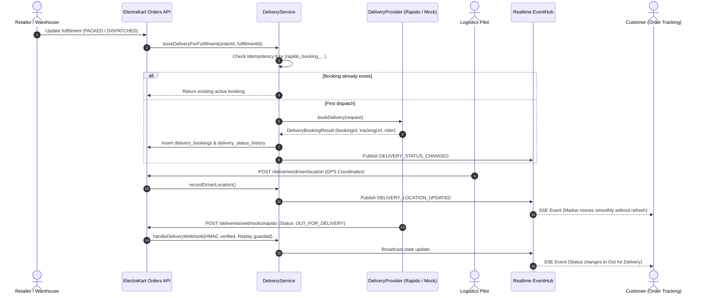

# ElectraKart Automated Delivery: Complete Logistics Architecture

This document details the automated logistics and carrier dispatch architecture for ElectraKart, including the provider abstraction layer, Rapido integration, driver telemetry, webhooks, and audit trails.

---

## 1. End-to-End Delivery Flow



---

## 2. Provider Abstraction Layer (`DeliveryProvider`)

ElectraKart defines a provider-neutral interface to isolate logistics operations from underlying 3rd-party vendor contracts:

```typescript
export interface DeliveryProvider {
  bookDelivery(request: CreateDeliveryRequest): Promise<DeliveryBookingResult>;
  getDeliveryStatus(providerBookingId: string): Promise<DeliveryStatusResult>;
  cancelDelivery(providerBookingId: string, reason?: string): Promise<CancelDeliveryResult>;
  isConfigured(): boolean;
  getProviderName(): string;
}
```

### 1. `RapidoDeliveryProvider` (Official Enterprise Integration)
- Connects to Rapido's B2B developer API when credentials are provided in `.env`:
  - `RAPIDO_API_KEY`
  - `RAPIDO_CLIENT_ID`
  - `RAPIDO_CLIENT_SECRET`
  - `RAPIDO_BASE_URL`
  - `RAPIDO_WEBHOOK_SECRET`
- **Zero Mock-Faking / Anti-Scraping Safeguard**: If official API credentials are not configured, the provider returns status `FAILED` with error code `RAPIDO_NOT_CONFIGURED`. It never pretends to be booked or scrapes consumer interfaces.

### 2. `MockDeliveryProvider` (Development & Automated Testing)
- Active when `DELIVERY_PROVIDER=mock` or during automated test runs.
- Returns deterministic tracking URLs (`https://track.electrakart.in/mock-rapido/...`), simulated riders, and instant booking IDs for full regression verification.

---

## 3. Strict Idempotency Protection

To guarantee that parallel HTTP retries or accidental double-clicks do not dispatch duplicate riders, an idempotency key is generated deterministically:

$$\text{idempotency\_key} = \text{"rapido\_booking\_"} + \text{order\_id} + \text{"\_"} + \text{fulfillment\_id}$$

- The database enforces a `UNIQUE` constraint on `delivery_bookings.idempotency_key`.
- If a dispatch is triggered for a fulfillment that already has an active booking (`status != 'FAILED'`), `DeliveryService` immediately returns the existing booking record without creating a new carrier booking.

---

## 4. Delivery Carrier Webhooks & Replay Defense

### Webhook Ingestion Endpoint
`POST /api/v1/deliveries/webhooks/:provider`

### Security Safeguards
1. **HMAC Signature Verification**:
   - The payload signature from `X-Webhook-Signature` or `X-Rapido-Signature` is compared against `crypto.createHmac('sha256', config.rapidoWebhookSecret).update(rawPayload).digest('hex')`.
2. **Replay Attack Defense**:
   - Every webhook event is cataloged in the `delivery_webhooks` table with a unique constraint on `(provider, provider_event_id)`.
   - If the same `provider_event_id` is re-sent by the carrier, the server returns HTTP 200 immediately without executing state transitions twice.
3. **Audit History Log**:
   - Every webhook event appends a new immutable row to `delivery_status_history` with the raw carrier payload for dispute resolution and compliance.

---

## 5. Super Admin Delivery Management

Accessible at `/admin/deliveries`:
- **Carrier Status Badge**: Displays `ACTIVE` or `RAPIDO_NOT_CONFIGURED` based on real environment variable validation.
- **Dispatch Ledger**: Searchable table displaying Order ID, Fulfillment ID, Customer Drop, Store Pickup, Rider Name, and Current Status.
- **1-Click Retry**: If a booking enters `FAILED` status (e.g. no riders available in zone), administrators can trigger a manual retry via `POST /api/v1/deliveries/bookings/:id/retry`.
