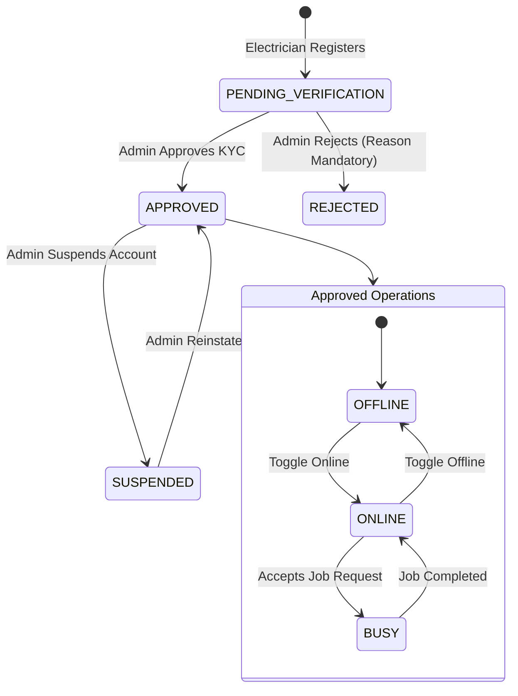
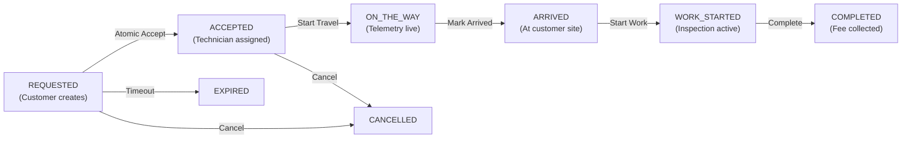

# ElectraKart Electrician Marketplace: Complete Lifecycle Specification

This document details the end-to-end operational and technical architecture of the ElectraKart Electrician Marketplace, connecting vetted technicians with homeowners, commercial contractors, and retail stores.

---

## 1. Electrician Lifecycle State Machine



---

## 2. Controlled Specializations List

To prevent arbitrary user-input categories and maintain high search relevance, specializations are restricted to canonical database values:

1. `WIRING` — Wiring & Cable Fitting
2. `FANS` — Fans (Ceiling, Exhaust, BLDC)
3. `LIGHTS` — Lights & Fixtures
4. `SWITCHES_AND_SOCKETS` — Switches & Sockets
5. `MCB_DB` — MCB & Distribution Boards
6. `ELECTRICAL_PANELS` — Electrical Panels & Meter Boards
7. `INVERTER_UPS` — Inverter & UPS Setup
8. `MOTORS` — Motors & Starters
9. `PUMPS` — Water Pumps & Submersibles
10. `APPLIANCE_INSTALLATION` — New Appliance Installation
11. `REPAIR` — Repair & Troubleshooting
12. `MAINTENANCE` — Preventive Maintenance & Safety Audit
13. `SOLAR_INVERTER` — Solar Inverter & Rooftop Solar
14. `SMART_HOME` — Smart Home Automation & IoT
15. `COMMERCIAL_ELECTRICAL` — Commercial Electrical Systems
16. `INDUSTRIAL_ELECTRICAL` — Industrial Electrical & Heavy Machinery
17. `OTHER` — General Electrical Services

---

## 3. Customer Search & Haversine Geolocation Matching

When a customer searches for electricians at `/customer/electricians`:
1. The backend queries `electrician_profiles` and filters by:
   - `verification_status = 'APPROVED'`
   - `is_online = TRUE`
   - `is_busy = FALSE`
2. Joins `electrician_specializations` where `category = $selectedCategory`.
3. Computes distance using the spherical Haversine formula:
   $$d = 2r \arcsin \left( \sqrt{\sin^2\left(\frac{\Delta \phi}{2}\right) + \cos(\phi_1)\cos(\phi_2)\sin^2\left(\frac{\Delta \lambda}{2}\right)} \right)$$
4. Filters results where $d \le \text{service\_radius\_km}$.
5. Orders results by distance ascending (`ORDER BY distance_km ASC`).

---

## 4. Atomic Concurrency Acceptance (Race Condition Guard)

To eliminate the possibility of two technicians accepting the same request concurrently, acceptance is executed using an atomic conditional update query:

```sql
UPDATE electrician_service_requests
SET status = 'ACCEPTED',
    assigned_electrician_id = $1,
    accepted_at = NOW(),
    customer_notified_at = NOW(),
    updated_at = NOW()
WHERE id = $2
  AND status = 'REQUESTED'
  AND (assigned_electrician_id IS NULL OR assigned_electrician_id = $1)
RETURNING *;
```

- **Winning Technician**: Receives HTTP 200 with the full service request payload.
- **Losing Technician**: The update modifies 0 rows. The server immediately returns **HTTP 409 Conflict** with:
  ```json
  {
    "type": "https://api.electrakart.com/errors/conflict",
    "title": "Job Already Assigned",
    "status": 409,
    "detail": "JOB_ALREADY_ASSIGNED: Service request #SR-2026-884920 is no longer available."
  }
  ```

---

## 5. Job Progression State Machine



Backward or out-of-order transitions are rejected with HTTP 400 (`Invalid status transition`).

---

## 6. Location Privacy Protection Rule

Electricians are mobile trade professionals. To protect their privacy:
1. **Offline Technicians**: Telemetry ingestion is strictly blocked if `is_online = FALSE` and there is no active job in progress.
2. **Online (Idle)**: Telemetry updates are used only for regional dispatch radius calculation and are never exposed to individual customers.
3. **Active Job (`ON_THE_WAY`)**: Real-time coordinates are streamed over SSE channel `electrician:<jobId>` exclusively to the customer who placed that specific request.
4. **Job Completed**: Real-time broadcast stops immediately upon transition to `COMPLETED`.

---

## 7. Server-Authoritative 1–5 Star Rating System

- Only the customer associated with a `COMPLETED` service request can submit a rating.
- Re-submissions are rejected via database unique constraint `uq_electrician_ratings_service_request`.
- A database trigger recalculates `rating_avg` and `rating_count` on `electrician_profiles` automatically.
