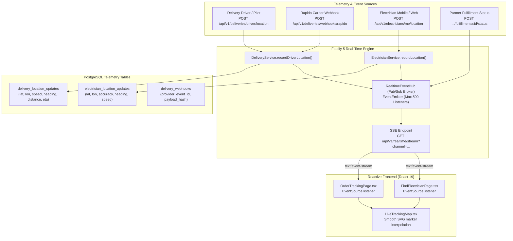

# ElectraKart Real-Time Telemetry & Tracking Architecture

This document specifies the real-time event streaming and live GPS tracking architecture for ElectraKart, delivering a modern Zomato/Swiggy-style experience without page refreshes.

---

## 1. System Topology



---

## 2. Server-Sent Events (SSE) vs WebSocket Justification

ElectraKart utilizes native HTTP/2-compatible **Server-Sent Events (SSE)** for telemetry streaming based on the following architectural evaluation:
1. **Unidirectional Telemetry Downlink**: Telemetry and status events flow strictly from backend to customer browser. The customer client does not need bidirectional byte sockets.
2. **Transparent Proxy & Render Support**: WebSockets require complex HTTP `Upgrade` headers and frequent ping/pong timeouts that often drop on free or containerized cloud tiers (such as Render or standard Nginx reverse proxies). SSE uses standard persistent HTTP streaming (`Content-Type: text/event-stream`).
3. **Native Browser Reconnection**: The standard browser `EventSource` API handles connection loss and automatic reconnection natively.
4. **Zero Heavy Dependencies**: Implemented using Fastify's native streaming capabilities without extra binary npm packages.

---

## 3. Real-Time Channel Hierarchy

All real-time streams are partitioned into strictly scoped channels:

| Channel Pattern | Intended Consumer | Authorized Roles | Events Broadcasted |
| :--- | :--- | :--- | :--- |
| `order:<orderId>` | Customer tracking their order | `CUSTOMER`, `ADMIN` | `DELIVERY_LOCATION_UPDATED`, `FULFILLMENT_STATUS_CHANGED`, `DELIVERY_STATUS_CHANGED` |
| `delivery:<bookingId>` | Operations / Dispatcher | `ADMIN`, `RETAILER`, `DISTRIBUTOR` | `DELIVERY_LOCATION_UPDATED`, `DELIVERY_STATUS_CHANGED` |
| `electrician:<jobId>` | Customer tracking technician | `CUSTOMER`, `ELECTRICIAN`, `ADMIN` | `ELECTRICIAN_LOCATION_UPDATED`, `SERVICE_JOB_STATUS_CHANGED` |
| `admin:all` | Super Admin Live Operations | `ADMIN` | All platform events (system-wide telemetry) |

---

## 4. Driver Telemetry Ingestion Contract

### Endpoint
`POST /api/v1/deliveries/driver/location`

### Headers
```http
Content-Type: application/json
Authorization: Bearer <driver_or_partner_jwt>
```

### Request Payload
```json
{
  "deliveryBookingId": "del-1790071640102-4821",
  "driverName": "Suresh Kumar (Rapido Captain)",
  "latitude": 16.5110,
  "longitude": 80.6430,
  "accuracy": 8.5,
  "heading": 65.0,
  "speed": 28.5,
  "distanceRemainingKm": 2.1,
  "etaMinutes": 7
}
```

### Response (201 Created)
```json
{
  "id": "dlu-1790071640150-3891",
  "deliveryBookingId": "del-1790071640102-4821",
  "driverName": "Suresh Kumar (Rapido Captain)",
  "latitude": 16.511,
  "longitude": 80.643,
  "accuracy": 8.5,
  "heading": 65,
  "speed": 28.5,
  "distanceRemainingKm": 2.1,
  "etaMinutes": 7,
  "recordedAt": "2026-09-22T15:10:40.150Z",
  "createdAt": "2026-09-22T15:10:40.150Z"
}
```

---

## 5. Live Vector Map (`LiveTrackingMap.tsx`) Features

1. **Auto-Centering & Projection**: Uses bounding-box projection to map geographic latitude/longitude directly into a normalized SVG viewport.
2. **Smooth Marker Interpolation**: CSS transitions (`transition-all duration-700 ease-out`) move the vehicle marker along the route without jumping.
3. **Route Progress**:
   - Amber line: Traversed distance from store to pilot.
   - Green dashed line: Remaining path to customer drop location.
4. **Stale Telemetry Detection**:
   - If the difference between the current time and `recordedAt` exceeds 60 seconds, the status pill changes to **"Location update delayed (carrier syncing)"** with an amber alert badge.
   - Old data is never falsely represented as live.
5. **No Full-Page Reload**: State updates are applied directly to React component state upon receiving SSE messages.
