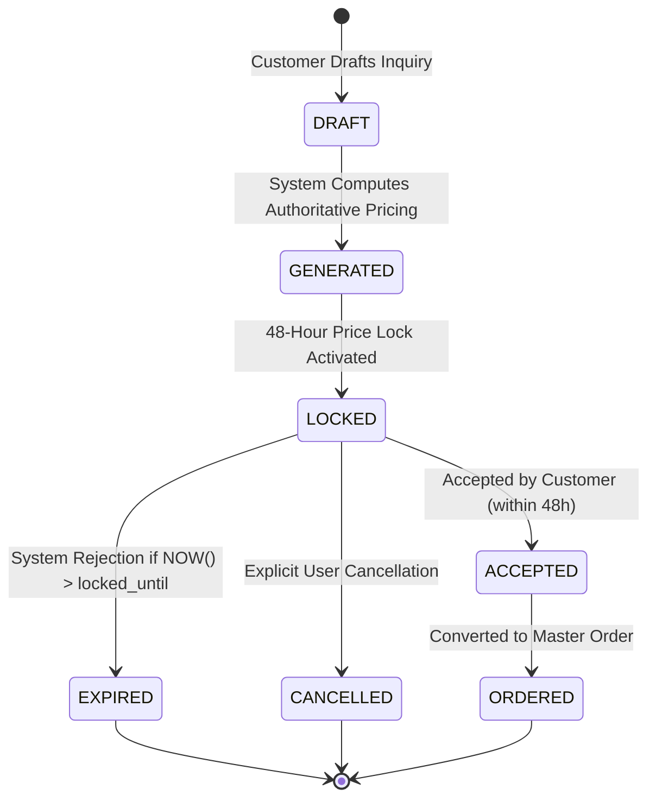
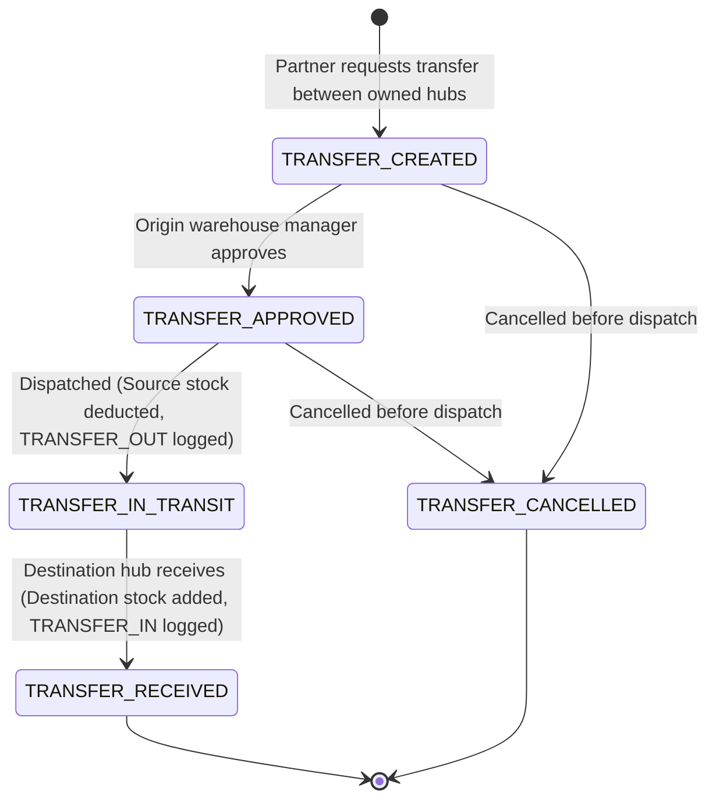
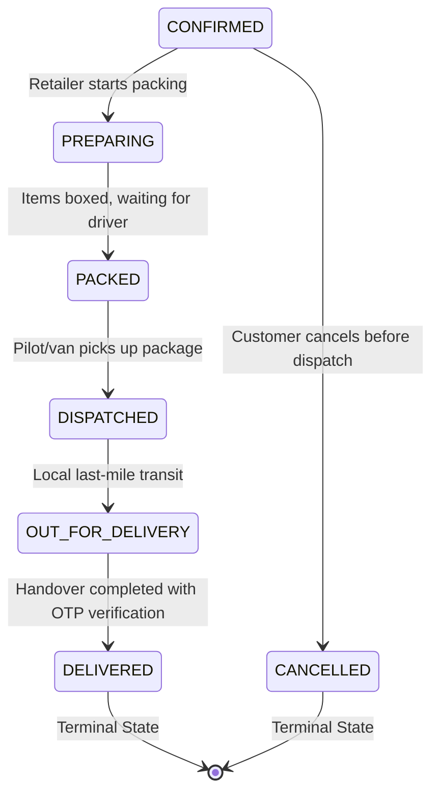

# ElectraKart — Business Architecture & Operational Completion Guide (Phase 3G)

**Version**: 1.0.0 (Phase 3G)  
**Status**: Production-Ready Architectural Standard  
**Applicability**: ElectraKart Core Backend Services (`quotations`, `inventory`, `warehouses`, `orders`, `payments`, `admin`, `audit`)

---

## 1. Overview & Business Objectives

ElectraKart bridges Indian electrical contractors, retail hardware stores, and authorized regional distributors into a unified commerce platform (*"From Estimate to Delivery"*). 

Phase 3G hardens the system with enterprise-grade business completeness:
1. **Quotation Lifecycle Integrity**: 48-hour deterministic price lock expiry with tamper resistance and explicit cancellation.
2. **Double-Entry Traceable Inventory Ledger**: Immutable transaction logging for every stock adjustment, reservation, release, and warehouse movement.
3. **Multi-Warehouse Stock Transfer Lifecycle**: Multi-step warehouse transfer protocol (`CREATED -> APPROVED -> IN_TRANSIT -> RECEIVED`) with tenant isolation and idempotency.
4. **Order Fulfillment State Machine**: Strictly forward linear state transitions (`CONFIRMED -> PREPARING -> PACKED -> DISPATCHED -> OUT_FOR_DELIVERY -> DELIVERED`) preventing reverse transitions or duplicate processing.
5. **Cancellations & Refunds**: Atomic inventory un-reservation, payment refund deduplication (HTTP 409 Conflict), and partner settlement cancellation.
6. **Invoicing & Settlement Isolation**: Immutable customer invoices, duplicate settlement prevention via database partial unique indexes, and partner earnings isolation with zero margin leakage.
7. **Comprehensive Sensitive Audit Logging**: Universal audit trail recording sensitive administrative, inventory, and governance operations with automatic payload credential scrubbing.

---

## 2. Quotation Lifecycle & Price Lock Expiry

### 2.1 State Transitions


### 2.2 Business Rules
- **48-Hour Guarantee**: Upon generation, `locked_until_timestamp` is computed as `NOW() + INTERVAL '48 hours'`.
- **Authoritative Expiry Check**: Any `GET` or `POST /quotations/:id/accept` request inspects `locked_until_timestamp < NOW()`. If expired, the status transitions to `EXPIRED` in the database, and acceptance is rejected with **HTTP 410 Gone**.
- **Tampering Rejection**: Once quotation is in `LOCKED` status, customer cart changes cannot modify the locked quotation items. Any item alterations require generating a fresh quotation.
- **Explicit Cancellation**: Users can cancel pending quotations via `POST /quotations/:id/cancel`, moving the state to `CANCELLED` and logging an audit event.

---

## 3. Double-Entry Inventory Ledger

### 3.1 Traceability Architecture
Every inventory fluctuation writes an immutable record to `inventory_transactions`. Stock adjustments and orders do not modify `partner_inventories` in isolation; they are transactionally paired with a ledger entry.

### 3.2 Transaction Types
| Transaction Type | Triggering Action | Stock Quantity Change | Reserved Stock Impact |
| :--- | :--- | :--- | :--- |
| `RESERVATION_ORDER` | Master order placed | 0 | `+quantity` |
| `CANCELLATION_RELEASE`| Order cancelled before dispatch | 0 | `-quantity` |
| `FULFILLMENT_DEDUCTION`| Fulfillment dispatched | `-quantity` | `-quantity` |
| `STOCK_ADJUSTMENT` | Retailer manual stock count | `+/- delta` | 0 |
| `TRANSFER_OUT` | Stock transfer dispatched | `-quantity` | 0 |
| `TRANSFER_IN` | Stock transfer received | `+quantity` | 0 |

### 3.3 RBAC Ledger Isolation
- **Retailer / Distributor**: `GET /api/v1/inventory/transactions` strictly filters transactions to their own `partner_id`. Access to other partners' logs is forbidden.
- **Admin**: Has platform-wide access to transaction records for reconciliation and fraud investigation.
- **Customer**: Forbidden (HTTP 403) from accessing inventory transaction ledgers.

---

## 4. Multi-Warehouse Stock Transfer Protocol

### 4.1 Lifecycle States


### 4.2 Security & Tenancy Invariants
1. **Cross-Partner Isolation**: Both `source_warehouse_id` and `destination_warehouse_id` must belong to the authenticated partner (`partner_id`). Attempting cross-partner inventory transfers is rejected with **HTTP 403 Forbidden**.
2. **Deduction upon Dispatch**: Source inventory is untouched during `TRANSFER_CREATED` and `TRANSFER_APPROVED`. Stock is deducted atomically upon dispatch (`TRANSFER_IN_TRANSIT`).
3. **Duplicate Receive Idempotency**: Subsequent calls to `/transfers/:id/receive` after receipt return `{ alreadyReceived: true }` without double-crediting destination stock.

---

## 5. Order State Machine Progression

### 5.1 Progression Rules


### 5.2 Transition Invariants
- **Linear Directionality**: Transitions are forward-only. An attempt to transition a package from `DELIVERED` back to `PREPARING` or `CONFIRMED` is rejected with **HTTP 400 Bad Request**.
- **Terminal States**: `DELIVERED` and `CANCELLED` are terminal states; no further status mutations are permitted.
- **Idempotency**: Submitting the current status again returns **HTTP 200 OK** with `{ idempotent: true }`.

---

## 6. Order Cancellation & Refund Mechanics

### 6.1 Cancellation Policy
- Customers and administrators can cancel orders in `CONFIRMED`, `PREPARING`, or `PACKED` status.
- Once any fulfillment has reached `DISPATCHED`, `OUT_FOR_DELIVERY`, or `DELIVERED`, order cancellation is blocked (**HTTP 409 Conflict**).

### 6.2 Atomic Rollback Sequence
Inside a database transaction (`db.withTransaction`):
1. Order status is updated to `CANCELLED`.
2. All child fulfillments are updated to `CANCELLED`.
3. Reserved inventory across all partner stores is unlocked (`reserved_quantity` decremented, `available_quantity` incremented).
4. `inventory_transactions` records `CANCELLATION_RELEASE` ledger entries.
5. All pending `partner_settlements` for the order are set to `CANCELLED`.
6. If payment was `CAPTURED`, a refund is issued via the payment gateway and `payments` is marked `REFUNDED`.
7. An audit log is committed recording the cancellation and reason.

### 6.3 Refund Deduplication
- Multiple refund requests for an already refunded transaction are rejected with **HTTP 409 Conflict** (`Payment has already been refunded`).

---

## 7. Invoicing & Partner Settlements

### 7.1 Customer Invoices
- Generated automatically upon successful payment verification.
- Numbering follows `INV-<OrderNumber>-<Sequence>`.
- Item totals, GST breakdown, discount, and grand total match authoritative order values.
- Invoices are tamper-resistant and read-only.

### 7.2 Partner Settlements
- Created upon order payment verification for internal accounting.
- **Partial Unique Constraint**: `idx_partner_settlements_active_ful` enforces that only one active settlement can exist per `fulfillment_id`:
  ```sql
  CREATE UNIQUE INDEX idx_partner_settlements_active_ful 
  ON partner_settlements(fulfillment_id) 
  WHERE status NOT IN ('CANCELLED', 'FAILED');
  ```
- **Settlement Tenancy**: Retailers only see settlements where `partner_id = user.partnerId`. Customers are forbidden (**HTTP 403**).

### 7.3 Financial Leakage Elimination
- Wholesale purchase costs (`purchase_cost_inr`), platform commission rates (`commission_rate_percent`), and net partner earnings are NEVER exposed in customer-facing APIs (`/catalog`, `/orders`, `/invoices`, `/quotations`).

---

## 8. Universal Audit Logging

### 8.1 Schema & Storage
The `audit_logs` table provides an immutable record of sensitive events:
- `id`: Unique identifier (`aud-<timestamp>-<random>`)
- `actor_user_id`: ID of the user performing the action
- `action`: Canonical action string (`ORDER_STATUS_CHANGE`, `INVENTORY_ADJUSTMENT`, `WAREHOUSE_TRANSFER_CREATED`, `PAYMENT_REFUND`, `PARTNER_GOVERNANCE_UPDATE`)
- `entity_type`: Target entity (`ORDER`, `INVENTORY`, `WAREHOUSE_TRANSFER`, `PAYMENT`, `PARTNER`)
- `entity_id`: Target entity ID
- `old_value`: JSONB representation before mutation
- `new_value`: JSONB representation after mutation
- `created_at`: Timestamp

### 8.2 Automatic Credential Scrubbing
Before writing to `audit_logs`, the `scrubAuditPayload` utility recursively redacts sensitive fields:
- `password`, `password_hash`, `token`, `secret`, `webhook_secret`, `api_key`, `signature`, `bank_account`.

### 8.3 RBAC Access Control
- Access to `GET /api/v1/admin/audit-logs` requires `ADMIN` role.
- Customers and Retailers attempting to query audit logs receive **HTTP 403 Forbidden**.
