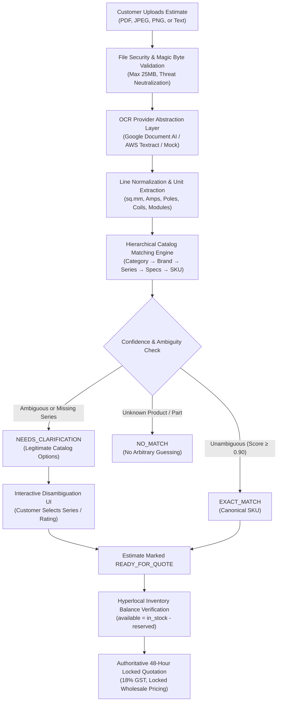

# ElectraKart Electrical Estimate OCR & Intelligent Product Matching

## 1. System Architecture Overview

ElectraKart's Estimate Processing Engine automates contractor and homeowner electrical bill parsing. It replaces error-prone manual quote creation with a resilient, hierarchical AI parsing pipeline connected to live PostgreSQL catalog and partner inventory tables.



---

## 2. Security & File Validation Engine

Before any OCR provider processes an incoming document, the file passes strict security controls:
1. **Magic Byte Verification**:
   - PDF: `%PDF` (`0x25, 0x50, 0x44, 0x46`)
   - JPEG: `0xFF, 0xD8, 0xFF`
   - PNG: `\x89PNG\r\n\x1a\n` (`0x89, 0x50, 0x4E, 0x47`)
2. **Payload Size Guard**: 25 MB hard ceiling (`26,214,400 bytes`).
3. **MIME & Extension Whitelist**: Only `.pdf`, `.jpg`, `.jpeg`, and `.png` allowed.
4. **Threat Neutralization**: Executables (`.exe`, `.sh`, `.bat`, `.cmd`, `.msi`) and scripts (`.js`, `.py`, `.php`) are rejected with `400 Bad Request`.
5. **Filename Sanitization**: Path traversals (`..`), null bytes (`\0`), and non-alphanumeric characters stripped.

---

## 3. OCR Provider Abstraction Layer

The engine isolates document extraction behind the `IOcrProvider` interface:

| Provider | Purpose | Environment | Configuration Keys |
| :--- | :--- | :--- | :--- |
| **MockOcrProvider** | Deterministic test fixtures (Fixtures A–F) for automated CI/CD pipelines | Development & CI ONLY (`NODE_ENV !== 'production'`) | `OCR_PROVIDER=mock` |
| **GoogleDocAiOcrProvider** | Google Cloud Document AI specialized document OCR | Staging & Production | `GOOGLE_DOC_AI_PROJECT_ID`, `GOOGLE_DOC_AI_LOCATION`, `GOOGLE_DOC_AI_PROCESSOR_ID` |
| **AwsTextractOcrProvider** | AWS Textract asynchronous/synchronous line and table parser | Staging & Production | `AWS_TEXTRACT_REGION`, `AWS_TEXTRACT_ACCESS_KEY_ID`, `AWS_TEXTRACT_SECRET_ACCESS_KEY` |

> [!CAUTION]
> **Strict Production Guard**:
> If `NODE_ENV === 'production'` and `OCR_PROVIDER === 'mock'`, the backend throws an unrecoverable fatal startup error, guaranteeing that mock simulators cannot run in production.

---

## 4. Normalization & Hierarchical Matching Engine

### Zero False-Positive Guarantee
In electrical contracting, guessing an SKU on an ambiguous line (e.g., fulfilling an industrial heavy load with a domestic piano switch, or SP instead of DP MCB) causes severe fire and shock hazards. ElectraKart enforces **Zero False Positives**:
- **Generic Descriptions** (e.g. `"6A switch - 10 Nos"` or `"Schneider 16A breaker"`) without brand or series **NEVER** match an exact SKU.
- They return status `NEEDS_CLARIFICATION` or `AMBIGUOUS` with confidence `MEDIUM` (0.65) and provide up to 4 plausible catalog candidate options.
- **Unknown Products** (e.g. non-existent brands or parts) return `NO_MATCH` with `matchedSkuCode: null` and confidence `LOW` (0.15).

### Matching Hierarchy
1. **Category**: Switches & Sockets, Wires & Cables, MCBs & Switchgear, Fans, Lighting.
2. **Brand**: Canonical brand resolution (`Polycab`, `Finolex`, `Anchor by Panasonic`, `Schneider Electric`, `Havells`, `Legrand`, `Philips`).
3. **Series**: Mandatory for switches, sockets, and switchgear (`Roma Classic`, `Penta`, `Arteor`, `Acti9 xC60`, `FlameX FR`, `ProSafe RCCB`).
4. **Specifications**:
   - Gauges: `0.75`, `1.0`, `1.5`, `2.5`, `4.0`, `6.0`, `10.0 sq.mm`
   - Current Ratings: `6A`, `10A`, `16A`, `20A`, `25A`, `32A`, `40A`, `63A`
   - Plate Modules: `1M`, `2M`, `3M`, `4M`, `6M`, `8M`, `12M`, `18M`
   - Poles: `Single Pole (SP)`, `Double Pole (DP)`, `Triple Pole (TP)`, `4-Pole`, `30mA`
   - Colors: `Red`, `Yellow`, `Blue`, `Green`, `Black`, `White`, `Magnesium`
5. **Exact SKU Selection**: Declared **only** when exactly 1 canonical SKU matches all essential dimensions.

---

## 5. API Contracts & Endpoints

### 1. `POST /api/v1/estimates/upload`
Uploads a document buffer (Base64) or raw text.
- **Request Body**:
  ```json
  {
    "filename": "contractor_estimate.pdf",
    "mimeType": "application/pdf",
    "fileBase64": "JVBERi0xLjQK...",
    "city": "Vijayawada",
    "pincode": "520002"
  }
  ```
- **Response `201 Created`**:
  ```json
  {
    "id": "est-1789893839731-8672",
    "status": "PARTIALLY_RESOLVED",
    "ocrProvider": "MOCK",
    "totalItemsExtracted": 4,
    "unresolvedCount": 1,
    "items": [
      {
        "id": "est-item-1",
        "rawText": "Polycab FlameX FR 2.5 sq mm red wire - 4 Coils",
        "detectedQuantity": 4,
        "detectedUnit": "Coil (90m)",
        "confidence": "HIGH",
        "confidenceScore": 0.95,
        "matchStatus": "EXACT_MATCH",
        "matchedSkuCode": "POL-WX-25-RED-90M",
        "inventoryAvailable": true,
        "availableStock": 11
      },
      {
        "id": "est-item-2",
        "rawText": "Anchor 6A switch - 20 Nos",
        "detectedQuantity": 20,
        "detectedUnit": "Nos",
        "confidence": "MEDIUM",
        "confidenceScore": 0.65,
        "matchStatus": "NEEDS_CLARIFICATION",
        "matchedSkuCode": null,
        "clarificationPrompt": "Which series of Anchor by Panasonic do you require (Roma Classic vs Penta)?",
        "candidateOptions": [
          { "sku": "ANC-ROM-6A1W-WHT", "name": "Anchor Roma Classic 6A 1-Way Modular Switch", "price": 460 },
          { "sku": "ANC-PEN-6A1W-WHT", "name": "Anchor Penta 6A 1-Way Piano Switch White", "price": 420 }
        ]
      }
    ]
  }
  ```

### 2. `GET /api/v1/estimates/:id`
Retrieves estimate status and line items. Enforces strict IDOR ownership checks.

### 3. `POST /api/v1/estimates/:id/items/:itemId/clarify`
Resolves an ambiguous item by customer selection.
- **Request Body**:
  ```json
  {
    "chosenSku": "ANC-ROM-6A1W-WHT",
    "quantity": 20
  }
  ```
- **Response `200 OK`**:
  Updates `estimate_items.match_status` to `RESOLVED`, links `matched_sku_id`, and if all items are resolved, transitions `estimates.status` to `READY_FOR_QUOTE`.

### 4. `POST /api/v1/estimates/:id/quote`
Synthesizes a legally binding, 48-hour price-locked quotation.
- **Response `201 Created`**:
  ```json
  {
    "quotationNumber": "EK-QUO-2026-6429",
    "isPriceLocked": true,
    "lockedUntilTimestamp": "2026-09-22T08:46:43.000Z",
    "status": "LOCKED",
    "subtotalInr": 23420.00,
    "gstTotalInr": 4215.60,
    "grandTotalInr": 27635.60
  }
  ```

---

## 6. Financial Integrity & Zero Dealer Margin Leakage

Under no circumstances does the customer-facing Estimate API return:
- Wholesale purchase costs (`purchase_cost_inr`)
- Dealer margins or retailer markups
- Platform commissions (`commission_rate_percent`)
- Partner settlement balances (`settlements` records)

Customers receive only consumer catalog prices with verified GST breakdown and 48-hour wholesale price locks.
