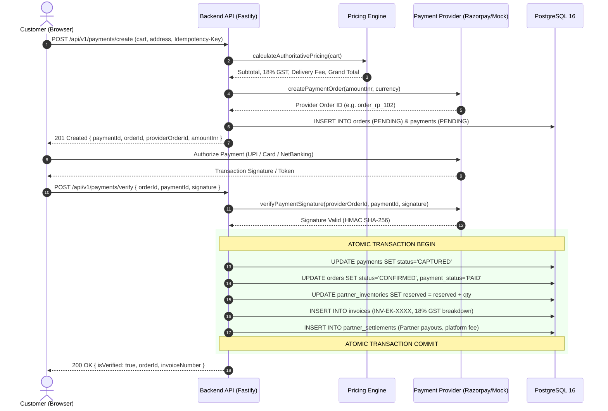
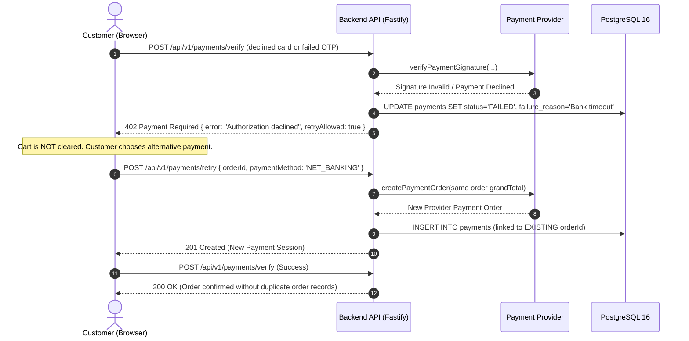
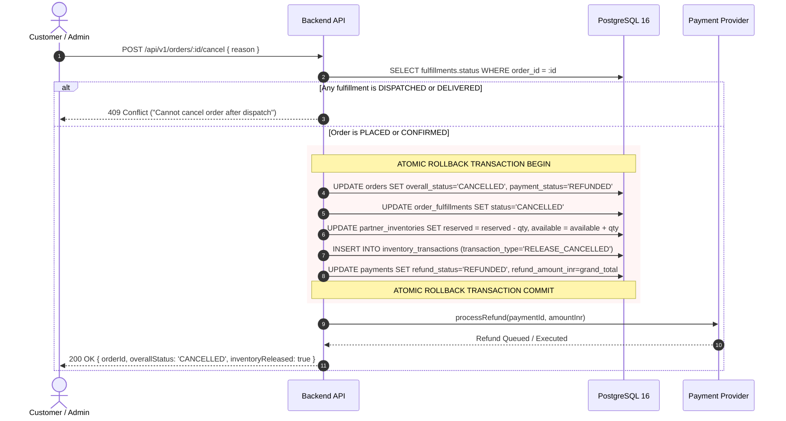

# ElectraKart — Payment & Financial Transaction Architecture

**ElectraKart** (*"From Estimate to Delivery"*) — Enterprise Electrical Commerce & Hyperlocal Logistics Platform.

---

## 1. Architectural Overview & Design Principles

The ElectraKart payment and financial architecture manages the transition of customer shopping cart intent into binding legal contracts, verified financial settlements, and atomic physical inventory movements across multi-vendor supply chains.

```
┌─────────────────────────────────────────────────────────────────────────────────────────────────┐
│                                     CUSTOMER CHECKOUT LAYER                                     │
│  [ React 19 + TypeScript SPA: Cart → Address → Delivery Speed → Payment Method → Verify ]       │
└──────────────────────────────────────────────┬──────────────────────────────────────────────────┘
                                               │ HTTPS API + Idempotency-Key
                                               ▼
┌─────────────────────────────────────────────────────────────────────────────────────────────────┐
│                                 ELECTRAKART TRANSACTION ENGINE                                  │
│                                                                                                 │
│  1. Authoritative Pricing Engine (18% GST, delivery fee threshold, discount rules)              │
│  2. Two-Phase Commit: Pending Order Creation ──► Atomic Inventory Reservation                   │
│  3. Payment Provider Abstraction (IPaymentProvider: Mock / Razorpay / Cashfree)                │
│  4. Verification Engine (HMAC SHA-256 Signature Validation & Webhook Ingestion)                 │
│  5. Post-Payment Lifecycle:                                                                     │
│     ├── Tax Invoice Generation (GST Section 31 compliant: CGST 9% + SGST 9%)                    │
│     ├── Multi-Partner Settlement Ledger (Internal accounting with ZERO customer margin leakage) │
│     └── Order Fulfillment Orchestration (Split routing across hyperlocal retailer & distributor)│
└──────────────────────────────────────────────┬──────────────────────────────────────────────────┘
                                               │
                                               ▼
┌─────────────────────────────────────────────────────────────────────────────────────────────────┐
│                              POSTGRESQL FINANCIAL DATA MODEL                                    │
│  • payments (provider details, captured state, refund tracking)                                 │
│  • invoices (immutable billing record, tax breakdown, GSTIN)                                    │
│  • partner_settlements (internal partner buy rates, platform fee, payable INR)                  │
│  • payment_webhook_logs (signature verification audit, replay attack deduplication)             │
│  • inventory_transactions (atomic locks, 'RESERVE_ORDER' and 'RELEASE_CANCELLED')                │
└─────────────────────────────────────────────────────────────────────────────────────────────────┘
```

### Core Architecture Tenets:
1. **Authoritative Server Pricing**: The frontend submits items and quantities only. The server recalculates selling prices, 18% GST (CGST 9% + SGST 9%), free delivery eligibility (orders $\ge$ ₹5,000), and bulk order discounts. Any client pricing tampering is strictly rejected.
2. **Provider Agnostic Abstraction**: The core business logic operates against an `IPaymentProvider` interface. Switching between deterministic development simulation (`PAYMENT_PROVIDER=mock`) and live gateways (`PAYMENT_PROVIDER=razorpay` or `cashfree`) requires zero changes to application code.
3. **Strict Production Environment Guard**: In `NODE_ENV=production`, setting `PAYMENT_PROVIDER=mock` causes immediate server startup failure. Production strictly demands verified gateway credentials.
4. **Zero Customer Margin Leakage**: Retailer purchase costs, platform commission percentages, and trade margins are isolated in the `partner_settlements` table and never exposed to customer API endpoints, serialized order models, or application logs.
5. **Atomic Inventory Lifecycle**: Reserved stock is committed atomically upon successful payment. If an order is cancelled prior to dispatch, an atomic database transaction releases the reserved stock back into active partner inventory (`RELEASE_CANCELLED`) and triggers an automated refund.
6. **Replay & Idempotency Protection**: Webhook events and order creation endpoints require idempotency keys and event deduplication via `payment_webhook_logs`.

---

## 2. Transaction Lifecycles & Sequence Workflows

### 2.1 Checkout & Payment Verification Flow


### 2.2 Payment Failure & Safe Retry Flow


### 2.3 Order Cancellation & Inventory Rollback Flow


---

## 3. Database Schema Extensions

Applied via migration `005_payment_financial_architecture.sql`:

### 3.1 Extended `payments` Table
```sql
ALTER TABLE payments
  ADD COLUMN IF NOT EXISTS provider VARCHAR(32) DEFAULT 'MOCK',
  ADD COLUMN IF NOT EXISTS provider_order_id VARCHAR(128),
  ADD COLUMN IF NOT EXISTS provider_payment_id VARCHAR(128),
  ADD COLUMN IF NOT EXISTS signature VARCHAR(256),
  ADD COLUMN IF NOT EXISTS failure_reason TEXT,
  ADD COLUMN IF NOT EXISTS refund_status VARCHAR(32) DEFAULT 'NONE',
  ADD COLUMN IF NOT EXISTS refund_amount_inr NUMERIC(12, 2) DEFAULT 0,
  ADD COLUMN IF NOT EXISTS raw_response_payload JSONB;

CREATE INDEX IF NOT EXISTS idx_payments_order_id ON payments(order_id);
CREATE INDEX IF NOT EXISTS idx_payments_provider_order_id ON payments(provider_order_id);
```

### 3.2 `invoices` Table (GST Section 31 Compliance)
```sql
CREATE TABLE IF NOT EXISTS invoices (
  id VARCHAR(64) PRIMARY KEY,
  invoice_number VARCHAR(64) NOT NULL UNIQUE,
  order_id VARCHAR(64) NOT NULL REFERENCES orders(id) ON DELETE CASCADE,
  customer_name VARCHAR(128) NOT NULL,
  customer_phone VARCHAR(32) NOT NULL,
  billing_address TEXT NOT NULL,
  shipping_address TEXT NOT NULL,
  seller_gstin VARCHAR(32) NOT NULL DEFAULT '37AAACE9921K1Z8',
  place_of_supply VARCHAR(64) NOT NULL,
  items JSONB NOT NULL,
  subtotal_inr NUMERIC(12, 2) NOT NULL,
  discount_inr NUMERIC(12, 2) NOT NULL DEFAULT 0,
  delivery_fee_inr NUMERIC(12, 2) NOT NULL DEFAULT 0,
  gst_total_inr NUMERIC(12, 2) NOT NULL,
  grand_total_inr NUMERIC(12, 2) NOT NULL,
  created_at TIMESTAMPTZ NOT NULL DEFAULT NOW()
);

CREATE INDEX IF NOT EXISTS idx_invoices_order_id ON invoices(order_id);
```

### 3.3 `partner_settlements` Table (Zero Margin Leakage)
```sql
CREATE TABLE IF NOT EXISTS partner_settlements (
  id VARCHAR(64) PRIMARY KEY,
  order_id VARCHAR(64) NOT NULL REFERENCES orders(id) ON DELETE CASCADE,
  fulfillment_id VARCHAR(64) NOT NULL REFERENCES order_fulfillments(id) ON DELETE CASCADE,
  partner_id VARCHAR(64) NOT NULL REFERENCES partners(id) ON DELETE CASCADE,
  gross_order_value_inr NUMERIC(12, 2) NOT NULL,
  commission_rate_percent NUMERIC(5, 2) NOT NULL,
  platform_fee_inr NUMERIC(12, 2) NOT NULL,
  partner_payable_inr NUMERIC(12, 2) NOT NULL,
  settlement_status VARCHAR(32) NOT NULL DEFAULT 'PENDING',
  created_at TIMESTAMPTZ NOT NULL DEFAULT NOW(),
  settled_at TIMESTAMPTZ
);

CREATE INDEX IF NOT EXISTS idx_settlements_partner_id ON partner_settlements(partner_id);
CREATE INDEX IF NOT EXISTS idx_settlements_order_id ON partner_settlements(order_id);
```

### 3.4 `payment_webhook_logs` Table (Replay Defense)
```sql
CREATE TABLE IF NOT EXISTS payment_webhook_logs (
  id VARCHAR(64) PRIMARY KEY,
  event_id VARCHAR(128) NOT NULL UNIQUE,
  provider VARCHAR(32) NOT NULL,
  event_type VARCHAR(64) NOT NULL,
  payload JSONB NOT NULL,
  signature VARCHAR(256),
  is_verified BOOLEAN NOT NULL DEFAULT FALSE,
  processed_at TIMESTAMPTZ NOT NULL DEFAULT NOW()
);
```

---

## 4. Payment Provider Abstraction

### 4.1 The `IPaymentProvider` Contract
```typescript
export interface IPaymentProvider {
  createOrder(input: CreatePaymentOrderInput): Promise<PaymentOrderResult>;
  verifyPayment(input: VerifyPaymentInput): Promise<PaymentVerificationResult>;
  processRefund(input: RefundInput): Promise<RefundResult>;
  verifyWebhookSignature(rawBody: string, signature: string, webhookSecret: string): boolean;
}
```

### 4.2 Factory Selection
The provider is instantiated dynamically using `getPaymentProvider()`:
- `PAYMENT_PROVIDER=mock`: Deterministic simulator for unit tests and local frontend preview.
- `PAYMENT_PROVIDER=razorpay`: Razorpay PG adapter with HMAC SHA-256 signature verification (`crypto.createHmac('sha256', keySecret)`).
- `PAYMENT_PROVIDER=cashfree`: Cashfree PG adapter for server-to-server token generation and signature verification.

---

## 5. Security & Financial Confidentiality

### 5.1 Zero Customer Margin Leakage
- Customer API endpoints (`GET /orders/:id`, `GET /invoices/:orderId`) sanitize outputs and never query or serialize `partner_settlements`.
- The `partner_settlements` endpoint (`GET /api/v1/settlements`) is protected by role-based authorization: only `ADMIN`, `DISTRIBUTOR`, and `RETAILER` (filtered to their own partner ID) can access settlements. Customers querying this endpoint receive an immediate `403 Forbidden`.

### 5.2 IDOR Ownership Validation
- Any request for `/payments/:id` or `/invoices/:orderId` validates whether `req.user.role === 'ADMIN'` OR `order.customer_id === req.user.id`. Any unauthorized customer attempt returns `403 Forbidden`.

### 5.3 Redaction of Payment Secrets
- All logging configurations redact sensitive keys including:
  `["keySecret", "webhookSecret", "secretKey", "password", "signature", "authorization"]`.

---

## 6. Verification & Automated Test Coverage

The test suite in `backend/tests/payments.test.ts` executes comprehensive automated assertions covering:
1. Rejection of client pricing tampering and validation of server-authoritative calculations.
2. Idempotency-Key caching on repeated order checkout attempts.
3. Verification of successful payment, atomic order confirmation, and inventory reservation.
4. Payment failure handling (HTTP 402) and safe retry without cart loss.
5. Webhook HMAC SHA-256 verification and replay attack deduplication.
6. Order cancellation before dispatch and atomic inventory release (`RELEASE_CANCELLED`).
7. Prevention of cancellation for dispatched or delivered orders (HTTP 409 Conflict).
8. IDOR ownership protection on payments and invoices (HTTP 403).
9. Zero margin leakage: customer rejection on settlement endpoints (HTTP 403).
10. Admin-only manual refund processing.
11. Rejection of `mock` provider when running under `NODE_ENV=production`.
